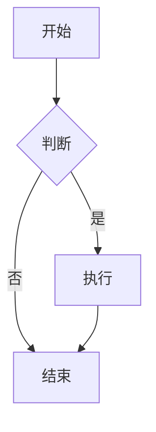

# Markdown 学习笔记 📝

## 什么是 Markdown？

Markdown 是一种轻量级标记语言，使用纯文本编写文档，可以转换成格式丰富的HTML页面。它被广泛用于：
- 编写技术文档
- 创建README文件
- 写博客文章
- 做笔记
- 编写API文档

## 基础语法

### 1. 标题 (Headers)

使用 `#` 符号来创建标题，`#` 的数量表示标题级别：

```markdown
# 一级标题
## 二级标题
### 三级标题
#### 四级标题
##### 五级标题
###### 六级标题
```

**效果：**
# 一级标题
## 二级标题
### 三级标题

### 2. 段落和换行

- 段落之间用空行分隔
- 在行末添加两个空格再回车可以强制换行   
- 开头的空格/缩进没有作用
```markdown
这是第一个段落。

这是第二个段落。     <-- 这必须有两个空格 
这行才会强制换行。    <-- 这必须有两个空格
    开头的空格没有作用
```
**效果 ：**  
这是第一个段落。

这是第二个段落。  
这行会强制换行。   
    开头的空格没有作用
### 3. 文本格式

#### 粗体和斜体

```markdown
*斜体文本*  **粗体文本**  ***粗体斜体文本***
```

**效果：**
*斜体文本*  **粗体文本**  ***粗体斜体文本***

#### 删除线

```markdown
~~删除的文本~~
```

**效果：** ~~删除的文本~~

### 4. 列表

#### 无序列表

```markdown
- 项目1
- 项目2
  - 子项目2.1
  - 子项目2.2
- 项目3

或者使用：
* 项目1
* 项目2
* 项目3

或者使用：
+ 项目1
+ 项目2
+ 项目3
```

**效果：**
- 项目1
- 项目2
  - 子项目2.1
  - 子项目2.2
- 项目3

或者使用：
* 项目1
* 项目2
* 项目3

或者使用：
+ 项目1
+ 项目2
+ 项目3

#### 有序列表

```markdown
1. 第一项
2. 第二项
3. 第三项
   1. 子项3.1
   2. 子项3.2
```

**效果：**
1. 第一项
2. 第二项
3. 第三项
   1. 子项3.1
   2. 子项3.2

### 5. 链接

```markdown
[链接文本](URL地址)

例如：
[百度](https://www.baidu.com)
[我的GitHub](https://github.com/username)
```

**效果：**
[百度](https://www.baidu.com)

### 6. 图片

```markdown


例如：


```

### 7. 代码

#### 行内代码

```markdown
使用 `code` 来标记行内代码。

例如：`print("Hello World")`
```

**效果：**
使用 `code` 来标记行内代码。   
`print("Hello World")`

#### 代码块

使用三个反引号包围代码块：

````markdown
```python
def hello_world():
    print("Hello, World!")
    return "Hello"
```
````

**效果：**
```python
def hello_world():
    print("Hello, World!")
    return "Hello"
```

### 8. 引用

```markdown
> 这是一个引用块
> 
> 可以包含多个段落
> 
>> 还可以嵌套引用
```

**效果：**
> 这是一个引用块
> 
> 可以包含多个段落
> 
>> 还可以嵌套引用

### 9. 水平分割线

```markdown
---

或者

***

或者

___
```

**效果：**    
---

### 10. 表格

```markdown
| 表头1 | 表头2 | 表头3 |
|-------|:-----:|------:|
| 左对齐 | 居中对齐 | 右对齐 |
| 内容1 | 内容2 | 内容3 |
| 数据1 | 数据2 | 数据3 |
```

**效果：**
| 表头1 | 表头2 | 表头3 |
|-------|:-----:|------:|
| 左对齐 | 居中对齐 | 右对齐 |
| 内容1 | 内容2 | 内容3 |
| 数据1 | 数据2 | 数据3 |

**表格对齐说明：**
- `:---` 左对齐
- `:---:` 居中对齐  
- `---:` 右对齐

### 11. 任务列表

```markdown
- [x] 已完成的任务
- [ ] 未完成的任务
- [ ] 另一个任务
```

**效果：**
- [x] 已完成的任务
- [ ] 未完成的任务
- [ ] 另一个任务

### 12. 脚注

```markdown
这里是一个脚注示例[^1]。

[^1]: 这是脚注的内容。
```

**效果：**
这里是一个脚注示例[^1]。

[^1]: 这是脚注的内容。

## 高级技巧

### 1. HTML 标签

Markdown 支持 HTML 标签，可以用于更复杂的格式：

```markdown
<details>
<summary>点击展开</summary>

这里是展开的内容。

</details>
```

### 2. 数学公式

许多 Markdown 编辑器支持 LaTeX 数学公式：

```markdown
行内公式：$E = mc^2$

块级公式：
$$
\int_{-\infty}^{\infty} e^{-x^2} dx = \sqrt{\pi}
$$
```

$$
\int_{-\infty}^{\infty} e^{-x^2} dx = \sqrt{\pi}
$$

### 3. 图表

一些 Markdown 编辑器支持 Mermaid 图表：

````markdown

````

## 常用 Markdown 编辑器

### 桌面应用
- **Typora** - 所见即所得的 Markdown 编辑器
- **Mark Text** - 开源 Markdown 编辑器
- **Obsidian** - 知识管理工具
- **Notion** - 协作平台

### 在线编辑器
- **StackEdit** - 在线 Markdown 编辑器
- **Dillinger** - 实时预览
- **HackMD** - 协作编辑

### VS Code 插件
- **Markdown All in One** - 功能全面的 Markdown 支持
- **Markdown Preview Enhanced** - 增强预览功能
- **Paste Image** - 快速粘贴图片

## 最佳实践

### 1. 文件命名
- 使用有意义的文件名
- 避免空格，使用连字符或下划线
- 例如：`python-tutorial.md` 或 `python_tutorial.md`

### 2. 结构组织
- 使用清晰的标题层次
- 保持一致的格式
- 添加目录（对于长文档）

### 3. 图片管理
- 将图片放在专门的文件夹中
- 使用相对路径引用图片
- 为图片添加有意义的描述

### 4. 代码示例
- 指定代码语言以获得语法高亮
- 保持代码简洁明了
- 添加必要的注释

## 示例文档

下面是一个完整的 Markdown 文档示例：

```markdown
# 项目名称

## 项目简介

这是一个示例项目，用于演示 Markdown 的使用。

## 功能特性

- 功能1：描述
- 功能2：描述
- 功能3：描述

## 安装说明

```bash
npm install package-name
```

## 使用方法

1. 导入模块
2. 配置参数
3. 调用函数


