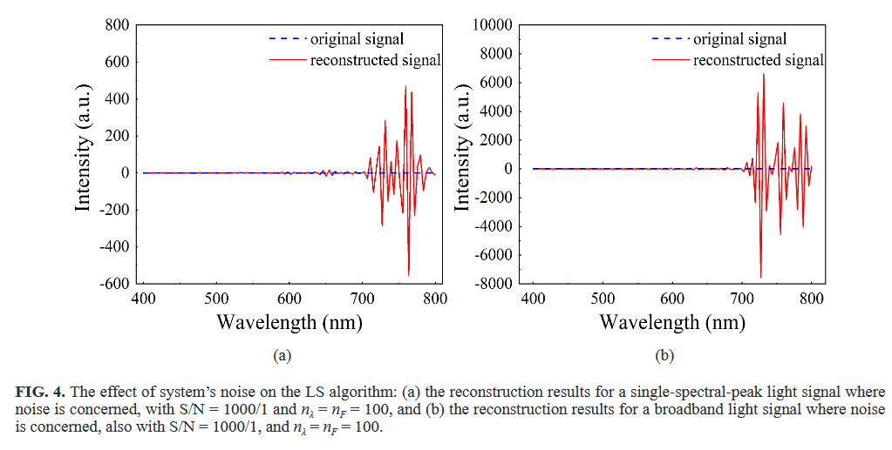
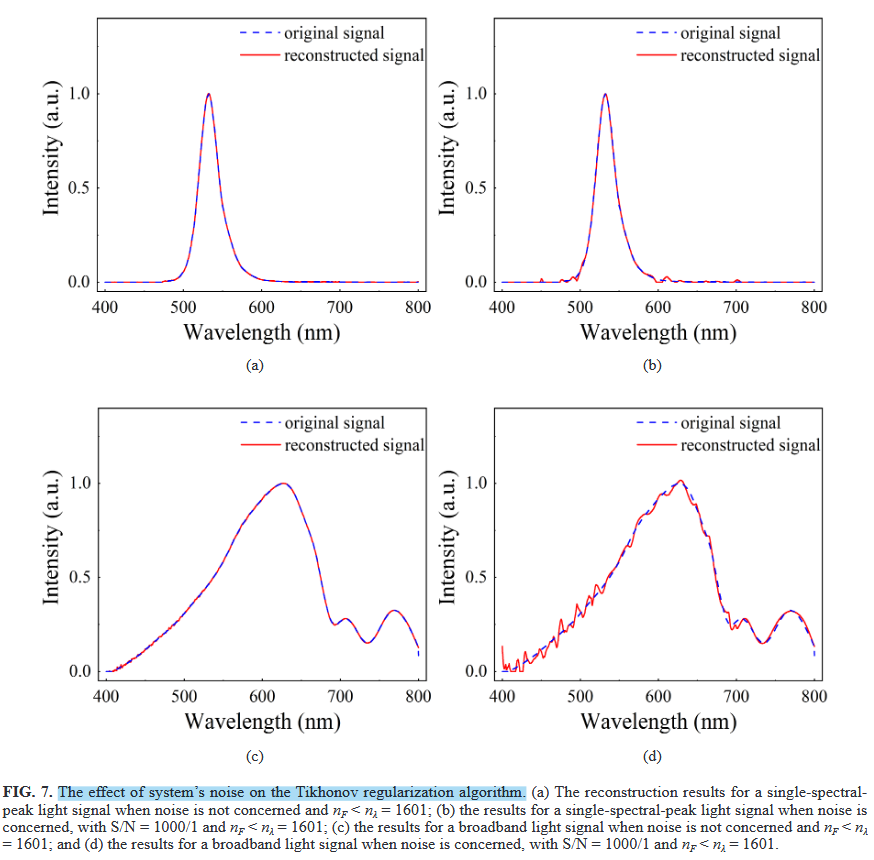
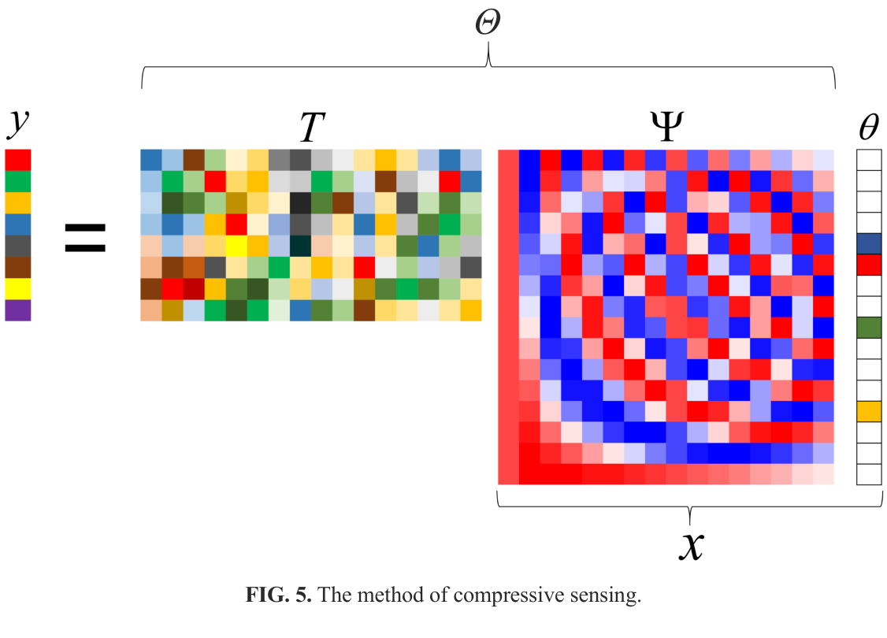
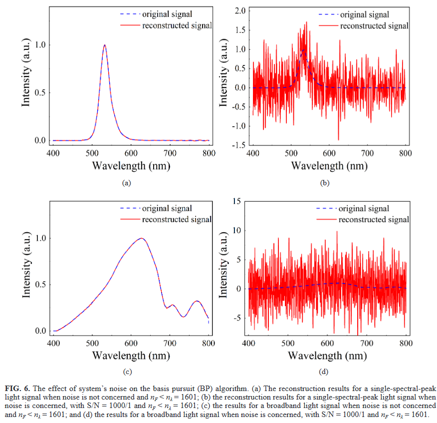
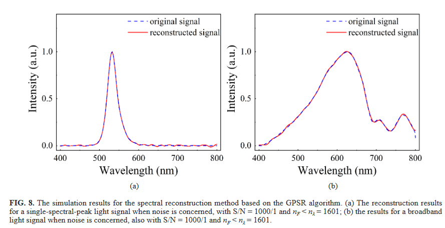

title: 论文总结
date: 2026-01-07
---

# Research on a Spectral Reconstruction Method with Noise Tolerance

- 作者：Yunlong Ye, Jianqi Zhang, Delian Liu*, Yixin Yang（Xidian University）
- 发表：Current Optics and Photonics, Vol. 5, No. 5, 2021, pp. 562–575
- 关键词：Compressive sensing, Noise tolerance, Spectrometer
- 目标对象：基于计算重建的小型化、低成本光谱仪
- **收获**：了解了各种计算重建算法的原理，优劣，适用场景和抗噪能力。

## 概要
- 研究问题：滤光片阵列型光谱仪需依赖重建算法，但现实场景噪声显著劣化结果；如何提高在噪声条件下的谱重构精度与稳健性。
- 核心方法：系统比较三类重构法（最小二乘/LS、Tikhonov L2 正则、基追踪/BP 与 BPDN 的 L1 正则），并提出将“梯度投影稀疏重构（GPSR）”用于光谱重构，提高噪声容忍度；同时引入稀疏化基（如 DWT）。
- 主要贡献：
  - 分析噪声对滤光片型光谱仪谱重构的系统性影响与构建方程特性（欠定/超定/适定）。
  - 基于仿真比较 LS、Tikhonov、BP/BPDN 与 GPSR 在单峰、双峰、宽带谱与不同噪声条件下的表现与失真模式。
  - 首次在该类光谱重构中系统引入 GPSR（含 GPSR-Basic 与 GPSR-BB），在噪声环境下显著优于 BP，且在宽带谱下优于 Tikhonov。
  - 给出选择稀疏化基（如离散小波 DWT）与正则参数 τ 的实践建议，减少所需滤光片数量。
- 关键结论：L1 类（GPSR/BPDN）较 L2（Tikhonov）对噪声更稳健；GPSR-BB 在效率与精度上兼顾，宽带重构尤其占优；选取合适稀疏化基可进一步增强去噪效果。

## 背景与建模
- 光谱形成模型：原始谱 Φ(λ) 经滤光片传递函数 Ti(λ) 与探测器响应 K(λ) 形成测量 Li。离散化后得到线性方程组 L = T Φ（忽略 K(λ) 或归一化处理）。
- 病态性：
  - nλ = nF：适定，唯一解；
  - nλ < nF：超定，宜用 LS；
  - nλ > nF：欠定，需正则化或稀疏先验（压缩感知）。
- 噪声来源：系统本底、环境光、器件随机噪声等，贯穿测量与重构全过程，直接影响谱峰位置、幅值与宽度。

## 算法与原理

1) 最小二乘线性回归（LS）
- 原理：在超定情形下最小化 ||T Φ − L||₂²；等价于求解正规方程或伪逆。
- 用途：测量方程**超定**且噪声较小/高 SNR；或作为基线解。
- 特点与差异：
  - 优点：实现简单、计算快；
  - 缺点：对噪声与病态（条件数大）敏感，易过拟合噪声或出现振铃；
  - 与正则化、稀疏法对比：无先验约束，稳健性最弱。
  
示意/仿真结果：

2) Tikhonov 正则化（L2）
- 原理：最小化 ||T Φ − L||₂² + τ||Φ||₂²；通过 L2 正则稳定反演、抑制噪声放大。
- 用途：适用于欠定/病态问题的稳健化解，尤其当谱不显著稀疏时；
- 特点与差异：
  - 优点：闭式或高效数值解，鲁棒性优于 LS；
  - 缺点：L2 倾向于平滑解，易“抹平”尖锐谱峰，宽带下可能过平滑；
  - 与 L1 类方法对比：去噪强但保边能力弱，对显著稀疏谱不如 L1。

示意/仿真结果：

3) 基追踪 BP 与去噪版 BPDN（L1）
- 原理：在稀疏化基 Ψ 下，令 Φ = Ψθ，将重构转为 θ 的稀疏解：
  - BP：min ||θ||₁ s.t. TΨθ = L（无噪声理想约束）；
  - BPDN：min ||θ||₁ s.t. ||TΨθ − L||₂ ≤ ε（含噪声容忍）。
- 用途：nF < nλ 的欠定情形，且谱在某基（如 DWT）下稀疏或近似稀疏；
- 特点与差异：
  - 优点：L1 对尖峰/稀疏结构保持性好，抗噪优于 LS；
  - 缺点：经典 BP 不面向噪声，BPDN虽可抗噪但求解代价较高（常用内点/二阶方法）。
    - 与 LASSO（τ）/BPDN（ε）的对标：存在一一对应使两者解集一致；τ 越大→更稀疏、残差上限 ε 越大；τ 越小→拟合更紧、ε 趋小。τ 可用 L-曲线/SURE/交叉验证或据噪声水平估计。

原理与仿真：

4) GPSR（Gradient Projection for Sparse Reconstruction）
- 原理：求解 L1 正则的最小二乘问题 min ½||TΨθ − L||₂² + τ||θ||₁。
  - 采用“梯度投影 + Barzilai–Borwein（BB）步长”等一阶策略（GPSR-Basic / GPSR-BB），效率高、可扩展。
  - 先将 θ 分解为正负部分（θ = u − v，u,v ≥ 0），对拼接变量做梯度步并投影到非负盒约束，步长采用 BB 两点式，加速一阶收敛。
- 用途：含噪情形的稀疏重构通用解法，适用于单峰/多峰/宽带谱，且对滤片数不足更友好。
- 特点与差异：
  - 优点：在噪声条件下显著优于 BP；对比 Tikhonov，在宽带谱下恢复更准确；计算效率较 BPDN 的二阶法更高；
  - 缺点：对正则参数 τ 较敏感，需经验或准则选取；
  - 实践：文中采用 GPSR-BB 版本，兼顾收敛速度与精度。

仿真结果：

5) 稀疏化基的选择（以 DWT 为例）
- 作用：将“非稀疏”原始谱在某变换域变为稀疏/近稀疏，提升 L1 类算法的可恢复性与抗噪性。
- 结论：选取与谱结构匹配的基（如小波）可明显减小环境光/系统噪声导致的背景抬升与伪峰。

## 噪声情景与实验设置（仿真）
- 情景：单峰、双峰、宽带谱；加入系统/环境噪声（文中展示含“ambient-light noise”等场景）。
- 比较对象：LS、Tikhonov、BP/BPDN、GPSR（GPSR-Basic/GPSR-BB）。
- 指标与观察：峰位偏差、峰宽变化、幅值偏差、伪峰/串扰、整体重构误差与视觉保真。

## 主要结果
- 总体规律：
  - LS 在噪声下劣化明显；且只适合超定
  - Tikhonov 较稳健但易过平滑，单峰/窄带表现尚可；
  - BP 不面向噪声，BPDN 可抗噪但开销偏高；
  - GPSR 对噪声容忍度高，在宽带谱重构中显著优于 Tikhonov，与 BPDN 相比具有更高效率与可扩展性。
- 细化结论：
  - 单峰/窄带：GPSR 与 Tikhonov 表现相近；
  - 宽带：GPSR 明显优于 Tikhonov（更好地兼顾去噪与细节保持）；
  - L1 vs L2：L1 倾向获取更稀疏/更结构化的解，抗噪且保边；L2 倾向平滑抑噪但损失细节。

## 用途选择建议
- 数据规模/方程形态：
  - 超定 + 低噪：LS 可作快速基线；
  - 病态/欠定 + 非稀疏：Tikhonov 稳健首选；
  - 欠定 + 稀疏/近稀疏：优先 L1（GPSR/BPDN），GPSR 更高效；
  - 宽带且含噪：GPSR 更优于 Tikhonov。
- 工程实践：优先选用与谱结构匹配的稀疏化基（如 DWT），并用折中策略选择 τ，以平衡去噪与细节保持。

## 局限性与未来方向
- 局限性：
  - 依赖稀疏先验与基选择；τ 的自动选取仍具挑战；
  - 实验主要为仿真，真实硬件多噪声源耦合与标定误差仍需验证。
- 未来方向：
  - 自适应/数据驱动的稀疏化基学习；
  - τ 的自适应选择（如 L 曲线、SURE 等）与稳健估计；
  - 与硬件联合优化（滤片设计 + 重构算法）。

 

## 参考信息
- 论文：Current Optics and Photonics 5(5):562–575, 2021（工作区已包含 PDF）
- 相关概念：BP/BPDN（L1 稀疏），Tikhonov（L2 正则），GPSR-Basic / GPSR-BB（梯度投影+BB 步长），DWT 稀疏化

---

